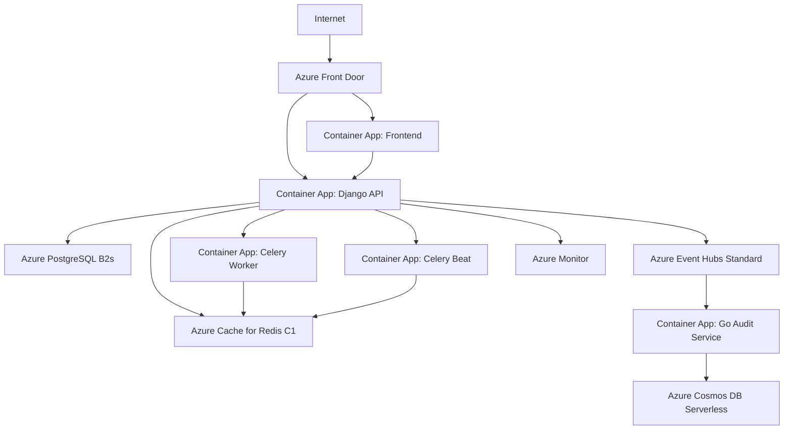

# ADR-0018: Azure Container Apps for Production Deployment

**Status:** Accepted
**Date:** 2026-01-19
**Owner:** Daniel de Queiroz Reis (Lead Developer)

## Context

HealthCoreAPI is a production-ready Django monolith with microservices (Go Audit Service) requiring deployment to a cloud provider. The project has evolved from a local development environment (Docker Compose) to requiring a scalable, maintainable production infrastructure on Microsoft Azure.

### Business Drivers

- **Deploy to Production:** Move from local development to cloud-hosted environment
- **$1000 Azure Credits:** Available through Microsoft for Startups program
- **6-8 Month Runway:** Timeline for initial production deployment and validation
- **Skill Development:** Lead developer (Daniel de Queiroz Reis) seeks to acquire modern cloud-native skills for career advancement
- **Portfolio Enhancement:** Demonstrate enterprise-grade Azure deployment for international job applications

### Technical Requirements

The system architecture includes:
- **Django API** (Python 3.12, Django 5.1)
- **PostgreSQL** database (production: 4GB RAM required for AI workloads)
- **Redis** cache (Celery worker/beat coordination)
- **Kafka** event streaming (Event-driven architecture)
- **DynamoDB-compatible** NoSQL (Go Audit microservice)
- **Grafana + Prometheus** observability stack
- **React Frontend** (TypeScript, Vite)
- **Go Audit Microservice** (gRPC + Kafka consumer)

### Deployment Options Evaluated

Three primary deployment strategies were considered on Azure:

1. **Virtual Machine (B2s):** Traditional IaaS approach
2. **Azure Kubernetes Service (AKS):** Container orchestration
3. **Azure Container Apps:** Serverless containers with managed services

## Decision

We will deploy HealthCoreAPI using **Azure Container Apps** with managed Azure services (PostgreSQL Flexible Server, Azure Cache for Redis, Event Hubs, Cosmos DB).

### Architecture



### Technology Mapping

| Component | Local (Docker Compose) | Azure (Production) | Compatibility |
|-----------|----------------------|-------------------|---------------|
| **PostgreSQL** | Container (postgres:15-alpine) | Azure Database for PostgreSQL Flexible (B2s) | 100% - Standard PostgreSQL |
| **Redis** | Container (redis:7-alpine) | Azure Cache for Redis (C1, 1GB) | 100% - Standard Redis |
| **Kafka** | Container (confluentinc/cp-kafka) | Azure Event Hubs Standard | 100% - Kafka API compatible |
| **DynamoDB** | Container (amazon/dynamodb-local) | Azure Cosmos DB Serverless | 100% - DynamoDB API compatible |
| **Grafana** | Container (grafana/grafana) | Container App | 100% - Same image |
| **Prometheus** | Container (prom/prometheus) | Container App | 100% - Same image |
| **Django/Frontend/Go** | Docker containers | Container Apps | 100% - Same images |

### Resource Specifications (Performance Tier)

```yaml
PostgreSQL:
  SKU: B_Standard_B2s
  vCPUs: 2
  RAM: 4GB
  Storage: 64GB
  Cost: $40-50/month

Redis:
  SKU: Basic C1
  RAM: 1GB
  Cost: $31/month

Event Hubs:
  SKU: Standard
  Partitions: 2
  Cost: $22/month

Container Apps:
  Django: 0.5 vCPU, 1Gi RAM, scale 0-3
  Frontend: 0.25 vCPU, 0.5Gi RAM, scale 0-2
  Go Audit: 0.25 vCPU, 0.5Gi RAM, scale 0-2
  Celery Worker: 0.5 vCPU, 1Gi RAM, scale 0-2
  Celery Beat: 0.25 vCPU, 0.5Gi RAM, 1 replica
  Grafana: 0.25 vCPU, 0.5Gi RAM
  Prometheus: 0.25 vCPU, 0.5Gi RAM
  Combined Cost: $50-70/month

Total Monthly Cost: $120-150
```

## Rationale

### Why Container Apps Over Alternatives?

#### 1. Career Development & Learning Objectives

**Primary Driver:** This project serves **dual purposes**:
- **Production System:** Enterprise-grade healthcare API (HIPAA-compliant, 90%+ test coverage)
- **Learning Platform:** Skill acquisition for Lead Developer (Daniel de Queiroz Reis)

**Skills Acquired Through Container Apps:**
- Serverless container orchestration (2026 industry trend)
- Azure managed services architecture
- Infrastructure as Code (Terraform for Azure)
- Event-driven architecture with Azure Event Hubs
- Multi-database strategy (PostgreSQL + Cosmos DB)
- Observability with Azure Monitor integration
- CI/CD with GitHub Actions + Azure
- Cost optimization strategies (scale-to-zero, right-sizing)

**Portfolio Impact:**
- Demonstrates knowledge of **modern Azure services** (not just VMs)
- Shows **polyglot architecture** (Python Django + Go + React)
- Proves **cloud-native** thinking (serverless, managed services)
- Valuable for **international job applications** (Azure Container Apps is cutting-edge)

#### 2. Technical Advantages

**Managed Services Ecosystem:**
- PostgreSQL Flexible Server: Automated backups, patching, high availability
- Azure Cache for Redis: Built-in monitoring, automatic failover
- Event Hubs: Kafka-compatible without container overhead (600MB saved)
- Cosmos DB: DynamoDB-compatible, serverless pricing

**Developer Experience:**
- Zero infrastructure maintenance (no OS patching, security updates)
- Auto-scaling based on load
- Built-in health checks and self-healing
- Integrated logging and monitoring

**Production Readiness:**
- Blue-green deployments via revision management
- Automatic TLS certificate management
- Built-in load balancing
- Regional failover capability (future)

#### 3. Cost Optimization Strategies

While more expensive than a single VM (see comparison below), Container Apps enables:

**Intelligent Scaling:**
- Frontend: Scale to 0 during off-hours (22h-6h BRT) → -33% cost
- Go Audit Service: Event-driven (only runs when Kafka has messages)
- Django API: Scale 1-3 based on traffic (not fixed at 3)

**Right-Sizing:**
- Each service gets exactly the resources it needs
- No over-provisioning (VM would waste resources for small services)
- Granular cost attribution per service

**Future Optimization Paths:**
- Move to Reserved Instances (30-50% discount) when traffic stabilizes
- Leverage spot instances for non-critical workloads
- Implement caching strategies to reduce database load

## Consequences

### Positive

✅ **Skill Development**
- Modern cloud-native architecture experience
- Azure-specific knowledge (valuable for job market)
- Serverless containers (industry trend 2026)
- Infrastructure as Code proficiency

✅ **Technical Benefits**
- Zero infrastructure maintenance
- Automatic scaling and self-healing
- Managed services reduce operational burden
- Built-in observability and monitoring

✅ **Production Advantages**
- High availability out-of-the-box
- Automated backups and disaster recovery
- Security patches managed by Azure
- Regional redundancy options (future)

✅ **Architecture Preservation**
- 100% API compatibility (Kafka, DynamoDB)
- Zero code changes required
- Same Docker images used locally and in production
- Seamless developer experience

### Negative

❌ **Higher Cost**
- $120-150/month vs $30-40 for VM (see detailed comparison below)
- Managed services premium (~3-4x more expensive)
- Trade-off accepted for learning objectives

❌ **Vendor Lock-In**
- Azure-specific services (Event Hubs, Cosmos DB, Container Apps)
- Migration to AWS/GCP would require refactoring
- Mitigation: Use Terraform for infrastructure portability

❌ **Complexity**
- More moving parts (7+ Azure services vs 1 VM)
- Requires Terraform knowledge
- Steeper learning curve initially

❌ **Cold Start Latency**
- Containers scaling from 0 have ~2-5s startup time
- Not acceptable for real-time applications
- Mitigation: Keep Django API min_replicas=1, frontend can scale to 0

### Mitigation Strategies

1. **Cost Management**
   - Set billing alerts at $100, $130, $150
   - Monitor daily costs via Azure Cost Management
   - Optimize scale-to-zero policies based on actual traffic
   - Timeline: Re-evaluate after 3 months of production data

2. **Complexity Handling**
   - Comprehensive documentation (this ADR + implementation plan)
   - Terraform modules for repeatability
   - Runbooks for common operations
   - Automated testing of infrastructure changes

3. **Vendor Lock-In**
   - Use Terraform (multi-cloud compatible)
   - Abstract Azure-specific services behind interfaces
   - Document migration paths in future ADRs if needed

## Cost Comparison: Container Apps vs Virtual Machine

> [!NOTE]
> **Alternative Considered:** For this specific project, a **single Azure VM B2s (2 vCPUs, 4GB RAM, 64GB storage)** running Docker Compose would achieve **identical functionality** at **3-4x lower cost**.

### VM Deployment Scenario (NOT CHOSEN)

**Configuration:**
- Azure VM B2s: 2 vCPUs, 4GB RAM
- Storage: 64GB managed disk
- Docker Compose running all services (PostgreSQL, Redis, Kafka, Grafana, Prometheus, Django, Frontend, Go, Celery)
- Total Cost: **$30-40/month**

**Why This Would Work:**
- 4GB RAM is sufficient for entire stack (tested locally)
- Docker Compose identical to development environment
- Single point of management (SSH into VM)
- Simplest possible deployment

**Why We Rejected This Option:**

1. **Learning Objectives Paramount**
   - VM deployment teaches traditional sysadmin skills (known by most developers)
   - Container Apps teaches modern cloud-native architecture (differentiator)
   - For Lead Developer Daniel de Queiroz Reis, **skill acquisition** > cost savings

2. **Portfolio & Career Impact**
   - "Deployed Django on Azure VM" → Common, not impressive
   - "Architected serverless multi-service platform on Azure Container Apps" → Demonstrates advanced cloud knowledge
   - Critical for international job applications requiring Azure experience

3. **Long-Term Scalability**
   - VM requires manual scaling (resize VM, coordinate with downtime)
   - Container Apps auto-scales per service independently
   - Future-proof for growth (when traffic increases)

4. **Operational Burden**
   - VM requires OS updates, security patches, monitoring setup
   - Container Apps delegates this to Azure
   - Time saved can be invested in feature development

### Cost-Benefit Analysis

| Factor | VM ($30-40/month) | Container Apps ($120-150/month) | Winner |
|--------|-------------------|---------------------------------|--------|
| **Raw Cost** | ✅ **3-4x cheaper** | ❌ More expensive | VM |
| **Skills Acquired** | ❌ Basic sysadmin | ✅ **Cloud-native architecture** | Container Apps |
| **Resume Value** | ❌ Common | ✅ **Differentiator** | Container Apps |
| **Scaling Effort** | ❌ Manual | ✅ **Automatic** | Container Apps |
| **Maintenance** | ❌ Manual patching | ✅ **Managed** | Container Apps |
| **Learning Curve** | ❌ Shallow | ✅ **Steep (valuable)** | Container Apps |

**Decision:** For a **purely production system** with cost as primary concern, **VM would be superior**. However, given:
- $1000 Azure credits available (6-8 months runway at $120-150/month)
- Lead developer's career advancement goals
- Portfolio enhancement for international job market
- Educational value of cloud-native architecture

**Container Apps is the strategic choice** despite higher cost.

### Future Migration Path

If cost becomes prohibitive after credits expire:
1. **Option 1:** Migrate to single VM (3-4x cost reduction)
2. **Option 2:** Apply for additional Azure credits (Microsoft for Startups renewal)
3. **Option 3:** Optimize Container Apps (reduce specs, increase scale-to-zero)
4. **Option 4:** Migrate to AWS (Terraform makes this feasible)

This decision will be re-evaluated in **6 months** (Q3 2026) based on:
- Actual production costs
- Traffic patterns
- Lead developer's job search status
- Available credits/funding

## Alternatives Considered

### 1. ❌ Azure Kubernetes Service (AKS)

**Pros:**
- Industry-standard container orchestration
- Maximum flexibility and control
- Rich ecosystem (Helm, Istio, etc.)
- Multi-cloud portable (K8s is everywhere)

**Cons:**
- **Cost:** $350-500/month (cluster + managed services)
- **Complexity:** Requires deep K8s knowledge (Helm charts, Ingress, cert-manager)
- **Overkill:** HealthCoreAPI doesn't need K8s-level orchestration
- **Maintenance:** Manual cluster upgrades, node pool management

**Rejection Reason:** Container Apps provides 80% of benefits at 40% of cost. K8s is overkill for this scale.

---

### 2. ❌ Azure Virtual Machine (B2s)

**Pros:**
- **Lowest cost:** $30-40/month (3-4x cheaper)
- Simple deployment (Docker Compose)
- Identical to local dev environment
- Easy to understand

**Cons:**
- Manual scaling (downtime required)
- OS patching responsibility
- Single point of failure
- **Lower learning value** (basic sysadmin, not cloud-native)
- **Less impressive on resume** (common approach)

**Rejection Reason:** See detailed cost comparison above. Prioritizing skill development over cost.

---

### 3. ❌ Azure App Service

**Pros:**
- Managed PaaS for web apps
- Simple deployment (Git push)
- Auto-scaling built-in

**Cons:**
- Limited to web apps (Django only, not Go service)
- No support for Grafana/Prometheus containers
- Less flexible than Container Apps
- Doesn't support custom Docker images well

**Rejection Reason:** Doesn't support polyglot architecture (Go microservice, Grafana, Prometheus).

---

### 4. ❌ Azure Functions (Pure Serverless)

**Pros:**
- True serverless (pay-per-execution)
- Auto-scaling to zero
- Lowest idle costs

**Cons:**
- Requires complete refactoring (Django → Azure Functions)
- Cold start latency (2-5s unacceptable for API)
- Limited execution time (10 min max)
- Stateful services (Grafana, Prometheus) not supported

**Rejection Reason:** Would require rewriting entire application. Container Apps provides serverless benefits without refactoring.

---

### 5. ❌ AWS Deployment (ECS/Fargate)

**Pros:**
- Similar to Azure Container Apps
- Larger community/ecosystem
- More mature serverless containers

**Cons:**
- **No Azure credits** (would require paying out-of-pocket)
- Lead developer already has $1000 Azure credits
- Azure experience more valuable for target job market (European companies use Azure heavily)

**Rejection Reason:** Azure credits available + strategic career decision (Azure skills).

## Implementation Plan

**Timeline:** 3-4 weeks

### Week 1: Infrastructure Setup
- Create Terraform modules for managed services
- Provision PostgreSQL, Redis, Event Hubs, Cosmos DB
- Configure networking and security groups
- Create Container Apps environment

### Week 2: Container Deployment
- Build and push images to GitHub Container Registry
- Deploy Container Apps for each service
- Configure environment variables and secrets
- Set up autoscaling policies

### Week 3: Integration & Testing
- Run database migrations
- Configure Event Hubs Kafka connections
- Test Cosmos DB DynamoDB compatibility
- Verify Grafana dashboards
- End-to-end smoke tests

### Week 4: Monitoring & Documentation
- Configure Azure Monitor alerts
- Set up billing alerts
- Document deployment procedures
- Create runbooks for common operations

## Success Metrics

- ✅ All services deployed and healthy
- ✅ Zero code changes required (100% compatibility)
- ✅ Monthly cost within $120-150 budget
- ✅ Auto-scaling working (verified via load tests)
- ✅ Cold start latency <5 seconds (frontend tolerable)
- ✅ Django API min_replicas=1 (no cold starts)
- ✅ Comprehensive documentation for operations
- ✅ Lead developer proficient in Azure Container Apps (LinkedIn post-worthy)

## References

- [Azure Container Apps Documentation](https://learn.microsoft.com/azure/container-apps/)
- [Azure Event Hubs Kafka Protocol](https://learn.microsoft.com/azure/event-hubs/apache-kafka-developer-guide)
- [Azure Cosmos DB DynamoDB API](https://learn.microsoft.com/azure/cosmos-db/dynamodb-api)
- [Terraform Azure Provider](https://registry.terraform.io/providers/hashicorp/azurerm/latest/docs)

## Related ADRs

- **ADR-0001:** Modular Monolith with Service-Repository Pattern
- **ADR-0007:** Terraform for Infrastructure as Code on Azure
- **ADR-0014:** Observability & Event-Driven Architecture
- **ADR-0016:** Audit Microservice Extraction (Go + NoSQL)

## Educational Context

> [!IMPORTANT]
> **Developer's Note:** As Lead Developer Daniel de Queiroz Reis, this deployment serves dual purposes:
>
> 1. **Production System:** Deliver enterprise-grade healthcare API to production
> 2. **Career Development:** Acquire modern Azure cloud-native skills for international job market
>
> While a single VM would be **3-4x cheaper** ($30-40/month vs $120-150/month), the investment in learning Azure Container Apps, managed services architecture, and Terraform-based IaC is strategically valuable for career advancement. The additional $80-110/month is effectively a **training budget** with a tangible portfolio output.
>
> This decision prioritizes **long-term career ROI** over short-term cost savings, leveraging available Microsoft for Startups credits ($1000) to gain production experience with cutting-edge Azure services.

---

**Approved by:** Daniel de Queiroz Reis (Lead Developer)
**Review Date:** 2026-07-19 (6 months after deployment, reassess cost vs. learning value)
